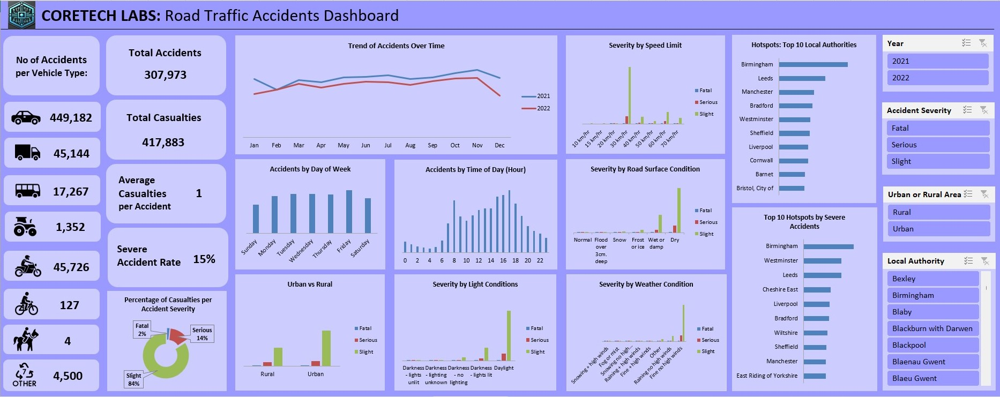

# Road Traffic Accident Analysis Dashboard in Excel

## Overview

This project analyzes road traffic accident data to identify patterns in accident frequency, severity, and key risk factors. Using Microsoft Excel, I cleaned and standardized the raw dataset, performed descriptive analysis, developed KPIs, and built an interactive dashboard to support data-driven road safety recommendations.

## Business Problem

Large accident datasets are difficult to interpret without proper cleaning, analysis, and visualization. The goal of this project was to transform raw accident data into clear, decision-ready insights that could support road safety planning and targeted interventions.

## Tools Used

- Microsoft Excel
- Data Cleaning
- Excel Tables
- PivotTables
- PivotCharts
- KPI Calculations
- Slicers
- Dashboard Design
- Descriptive Statistics

## Dataset Overview

The dataset includes road traffic accident records with variables such as:

- accident date
- accident severity
- local authority
- urban or rural area
- weather condition
- light condition
- road surface condition
- speed limit
- number of casualties
- number of vehicles involved
- vehicle type

## Project Workflow

- Cleaned and standardized the raw dataset for analysis
- Structured the cleaned data into Excel tables
- Built PivotTables and PivotCharts to analyze accident patterns
- Calculated KPIs such as total accidents, total casualties, average casualties per accident, and severe accident rate
- Developed an interactive dashboard with slicers for year, accident severity, urban/rural area, and local authority
- Summarized findings and recommendations in a reporting slide deck

## Dashboard Preview

Interactive Excel dashboard showing accident trends, severity patterns, and geographic hotspots.

## Key Insights

- Most accidents were classified as slight, though fatal and serious accidents still accounted for a meaningful share of total accidents
- Accident counts were highest during weekday activity periods, especially late afternoon hours
- Urban areas recorded more accidents overall, while rural areas showed a higher severe accident share
- Higher speed roads were associated with more severe accidents
- Darkness with no lighting emerged as a key risk factor for accident severity
- Some local authorities consistently appeared as hotspots for both total and severe accidents

## Recommendations

- Prioritize speed management on higher-speed roads
- Improve lighting in high-risk dark locations
- Strengthen maintenance and warning systems for poor road surface conditions
- Target road safety interventions around peak accident periods
- Use hotspot rankings to guide local planning and resource allocation

## Project Files

- `CoreTech_Labs_Excel_Workbook.xlsx`
- `road-accident-overview-dashboard-preview.jpg`
- `road-accident-risk-factors-dashboard-preview.jpg`
- `CoreTech_Labs_Project_Overview.docx`

## What This Project Demonstrates

This project demonstrates the ability to use Excel as an analytics and reporting tool for decision support, covering the full workflow from raw data cleaning and analysis through dashboard creation, insight development, and recommendation communication.
